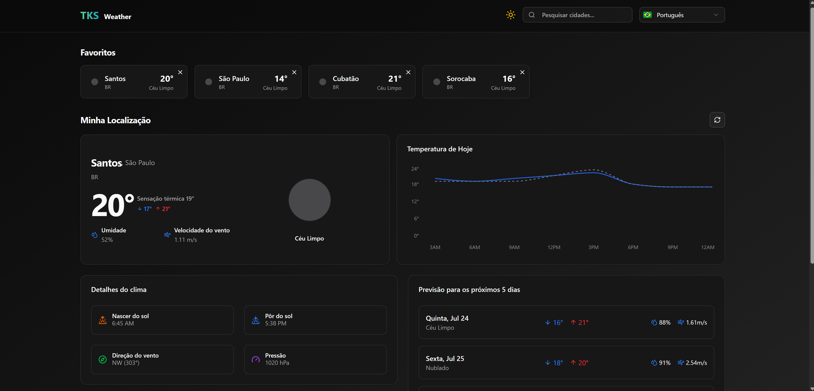

## TKS Weather
Site de Consulta da Previsão do Tempo, Temperatura e Detalhes do Clima 

<h1 align="center">
  
</h1>

<br /><br />

## 🚀 Tecnologias
- [TypeScript](https://www.typescriptlang.org/) > Linguagem Principal da Aplicação
- [NextJS](https://nextjs.org/) > Framework com React para criação do Layout 
- [TailwindCSS](https://tailwindcss.com/) > Extensão para o NextJS para estilização das páginas
- [Shadcn](https://ui-v4.shadcn.com/) > Biblioteca de Componentes para o NextJS
- [Lucide React](https://lucide.dev/) > Biblioteca de ícones
- [Next Intl](https://next-intl.dev/) > Biblioteca para tradução de textos
- [OpenWeather API](https://openweathermap.org/) > API de Consulta do Clima

<br /><br />

## 💻 Executando o Projeto


#### 1º Passo - Configure as Ferramentas necessárias para rodar o projeto:

- [Node.js](https://nodejs.org/en/) (Versão 22)


#### 2º Passo - Instale as Dependências:

```bash
$ npm install
```

#### 3º Passo - Configure o arquivo .env (Cole a sua Key da API):

```bash
NEXT_PUBLIC_API_GEO="https://api.openweathermap.org/geo/1.0"
NEXT_PUBLIC_API_WEATHER="https://api.openweathermap.org/data/2.5"
NEXT_PUBLIC_API_KEY=
```

#### 4º Passo - Rode o projeto:

```bash
# development
$ npm run dev
```

<br /><br />

## Link do Deploy
https://tks-weather.vercel.app/